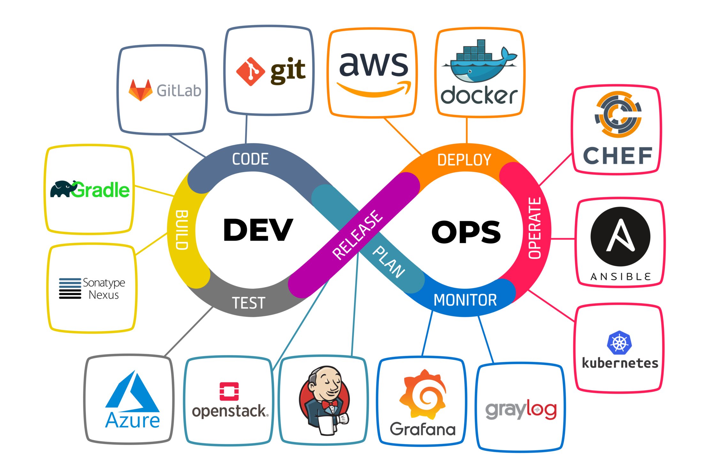

## Overview

Kalian anak IT? udah pernah denger yang namanya Development Operationals belum? kalau belum sini saya jelaskan. Berdasarkan pengertian google DevOps adalah serangkaian praktik yang bertujuan untuk meningkatkan kolaborasi dan komunikasi antara tim pengembangan (Development) dan tim operasional (Operations) dalam proses pengembangan dan pengelolaan sistem perangkat lunak.

Masih bingung? mari kita ambil contoh. Bayangkan ada pabrik mobil yang ingin memproduksi mobil yang berkualitas tinggi dan sesuai dengan kebutuhan pelanggan. Dalam hal ini, tim pengembangan (Development) seperti tim desain yang merancang mobil, sedangkan tim operasional (Operations) seperti tim produksi yang memasang mobil.

Dalam model tradisional, tim desain dan tim produksi bekerja secara terpisah, sehingga mobil yang diproduksi mungkin tidak sesuai dengan kebutuhan pelanggan. Namun, dengan adanya DevOps, tim desain dan tim produksi bekerja sama untuk memastikan bahwa mobil yang diproduksi adalah yang terbaik dan sesuai dengan kebutuhan pelanggan.

	Terus gunanya DevOps cuman itu aja?

Tentunya tidak, ini adalah keuntungan sebuah perusahaan jika menggunakan DevOps:

- Komunikasi lebih baik antar team
- Proses development yang cepat
- Output dengan kualitas tinggi
- Fleksibilitas dan Skalabilitas
- Dan masih banyak lainnya

DevOps juga punya gaji diatas rata-rata pekerjaan IT biasa loh, dari sini tertarik gak untuk belajar DevOps?
