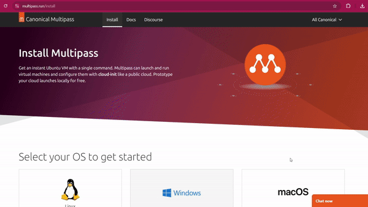

Author : snickerdoodless

# **Chapter1. Linux and Virtualization**
***
- [Introcution to Linux](#introduction-to-linux)
- [Virtualization](#virtualization)
	- [Multipass](#multipass)
		- [Installing Multipass](#installing-multipass)
	    - [Launching Multipass](#launching-multipass)
- [Command Line Interface](#command-line-interface)
	- Basic Commands
		- Navigating
		- Creating
		- Removing
		- Manual
	- Command Line Expansions
		- Pattern Matching
		- Redirection
- Summary


# Introduction to Linux
***


Sedikit perkenalan untuk operting system Linux untuk kalian yang belum tahu apa itu Linux. Jadi intinya sama seperti Windows yang kalian pake, Linux itu salah satu dari banyaknya Sistem Operasi.

Linux itu banyak gak cuman 1 kalau kalian penasaran bisa lihat [disini](https://upload.wikimedia.org/wikipedia/commons/1/1b/Linux_Distribution_Timeline.svg), Tapi jangan pusing, Dari segitu banyaknya versi dari Linux modul ini bakalan fokus pake yang versi Ubuntu aja.

Ada satu hal yang membedakan user Linux dan Windows yaitu penggunaan Terminal atau bisa disebut juga dengan Bash kalau di Windows itu sama seperti CMD/Powershell, user Linux sudah pasti bisa pakai Windows tapi belum tentu sebaliknya.

Tapi kalian tau gak kalo di komputer itu bisa di install komputer lagi?

Ayo kita kenalan dengan Virtualisasi!


# Virtualization
***
Pernah kebayang gak? Install Linux didalam Windows? Keren kan!, Itulah gunanya Virtualisasi, dengan adanya teknologi ini jadi kita gak perlu tuh beli banyak banyak komputer untuk dijadikan environment.

Contoh, Misalkan suatu perusahaan mau membuat websitenya sendiri otomatis yang dia butuhkan environment komputer khusus untuk server, database, dan komponen lainnya, coba kalian bayangin dari segitu banyaknya requirements untuk membuat suatu website, Masa perusahaan tersebut harus beli banyak komputer? Gak efisien kan? Mahal pula 🥴.

Disinilah Virtualisasi masuk, Untuk lebih memahami Virtualisasi mari kita analogikan, Bayangkan kamu memiliki sebuah bangunan besar yang dapat menampung banyak apartemen. Setiap apartemen memiliki ruangannya sendiri, tetapi mereka semua berbagi infrastruktur yang sama, seperti listrik, air, dan jaringan.

Dalam konteks Virtualisasi, bangunan apartement tersebut dapat diibaratkan sebagai sebuah server host kalian, sedangkan apartemen-apartemen di dalamnya dapat diibaratkan sebagai mesin virtual (VM).

Setiap VM memiliki sistem operasi dan aplikasinya sendiri, tetapi mereka semua berjalan di atas infrastruktur yang sama, yaitu server host. Dengan demikian, Resource server host kalian (Hardware) dapat dibagi dan digunakan secara efisien oleh banyak VM.

Coba lihat gambar berikut:


Simpelnya gini,

Operating System pada umumnya
```
Hardware > OS Host > Application
```


Operating System pada virtualisasi
```
Hardware > OS Host > Virtualization > Sharing Resource Hardware > OS VM > Application 
```


Jadi intinya kalau mau install OS seperti pada umumnya caranya cuman install OS pada Hardware kalian, Sedangkan Virtualisasi sama seperti yang sudah dianalogikan diatas untuk menjalankan Virtualisasi di komputer kalian Hardware kalian akan sharing resource (Hardwarenya) dengan OS host untuk membuat mesin Virtualisasi baru, Begitu jadinya.😊

Sekarang, karena kalian sudah paham tentang Virtualisasi, ayo kita praktekan dengan mencoba membuat VM di Multipass, Let's goo!


## Multipass

Sekarang kita akan belajar Ubuntu dengan menggunakan Multipass, Jadi intinya Multipass ini adalah sebuah software yang khusus untuk Virtualisasi.

> Kenapa pake Multipass? Kan ada yang lain kayak Vbox dan kawan-kawan.

Karena Multipass itu lebih ringan dan cepat jadi kita memutuskan untuk memakai Multipass, Langsung aja cara install Multipass dibawah ini.

> [!NOTE]
> Modul ini menggunakan Windows untuk menginstall Multipass, kalau kalian pake Linux silahkan menyesuaikan saja.

### Installing Multipass

Klik link [ini](https://multipass.run/install) dan pilih Windows untuk download.

Setelah terdownload buka Multipass installernya lalu klik next aja terus hingga selesai.



Next buka Windows terminal dengan cara pencet logo Windows + R terus ketik (CMD/Powershell).


> [!NOTE]
> Disini saya menggunakan CMD, kalian bebas bisa gunakan Terminal lain.

### Launching Multipass

Buat kalian yang masih belum biasa dengan Terminal cukup ikutin aja, nanti lama lama terbiasa 😉.

Untuk membuat Virtual Machine baru
```bash
multipass launch --name ubuntu-instance
```

Untuk melihat Virtual Machine yang sudah dibuat
```bash
multipass ls
```

Untuk remote execution command
```bash
multipass exec ubuntu-instance whoami
```

Kalian juga bisa melihat command-command lainnya dari Multipass dengan cara dibawah ini.


Seperti yang kalian lihat untuk mengetahui command-command dimultipass itu buat apa saja tinggal tambahkan "--help" di belakang command

Nah, Sekarang multipass kita sudah siap dipakai selanjutnya kita akan belajar tentang command-line let's go to next section!

# Command Line Interface

