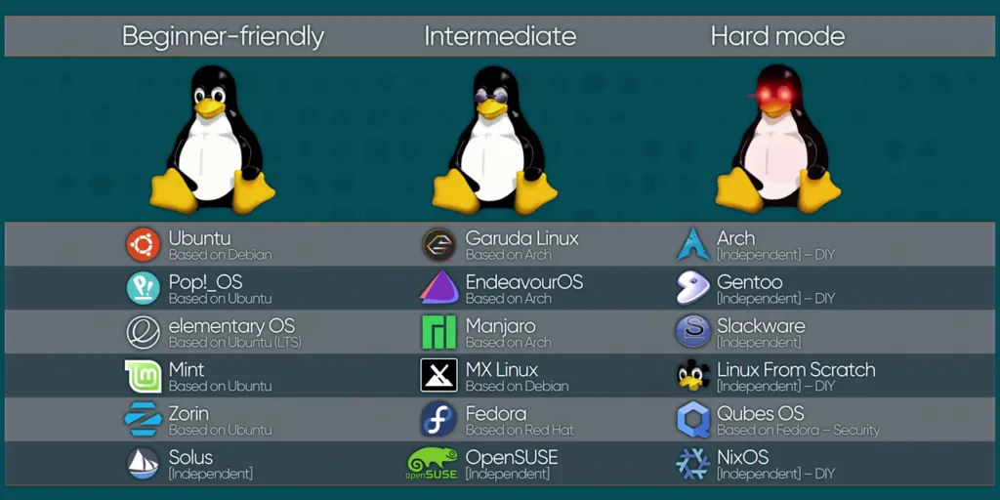
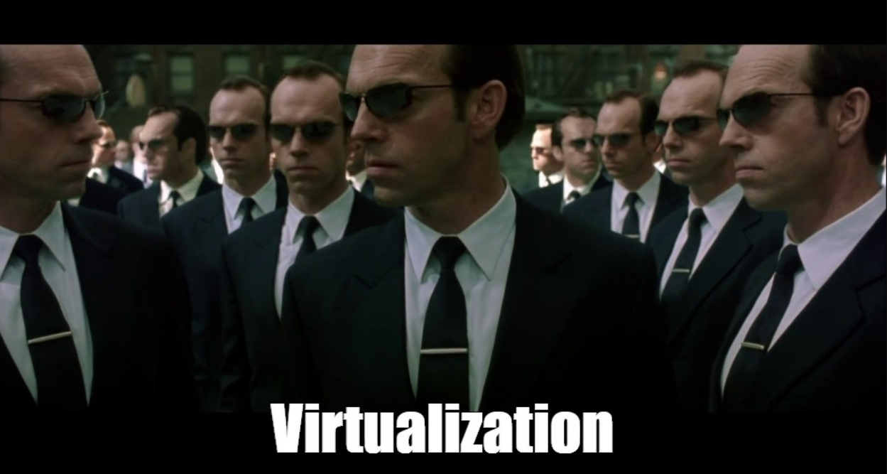
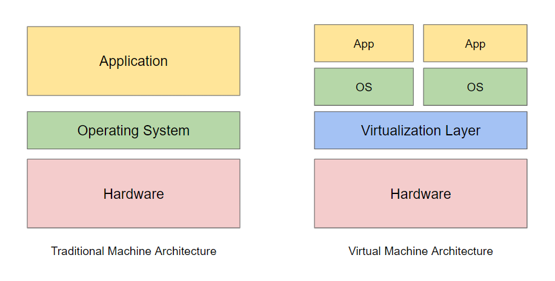
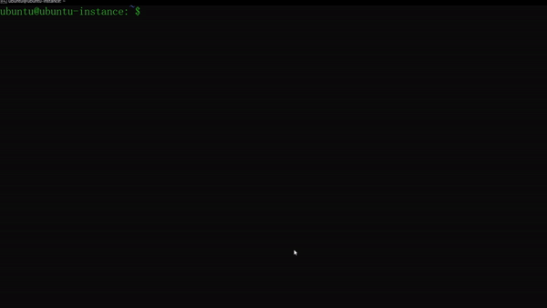

Author : snickerdoodless

> Quick introduction my name is Kheyral Sutan and i wrote this chapter and if you see soo many images and gif because the way i learn is easier to see a visual representation from a theory. Thanks and enjoy reading.

# Chapter 1. Linux and Virtualization
***
- [Introcution to Linux](#introduction-to-linux)
- [Virtualization](#virtualization)
	- [Multipass](#multipass)
		- [Installing Multipass](#installing-multipass)
	    - [Launching Multipass](#launching-multipass)
- [Command Line Interface](#command-line-interface)
	- [Basic Commands](#basic_commands)
		- [Navigating Linux System](#navigating-linux-system)
		- [Managing File & Folder](#managing-file-&-folder)
		- [Linux Manpages](#linux-manpages)
	- Command Line Expansions
		- Redirection
		- List Operator
		- Pattern Matching
- Linux File System
- Summary

<br />

# Introduction to Linux
***


<br />

Sedikit perkenalan untuk operting system Linux untuk kalian yang belum tahu apa itu Linux. Jadi intinya sama seperti Windows yang kalian pake, Linux itu salah satu dari banyaknya Sistem Operasi. Linux itu banyak gak cuman 1 kalau kalian penasaran bisa lihat di URL berikut [Linux Distribution](https://upload.wikimedia.org/wikipedia/commons/1/1b/Linux_Distribution_Timeline.svg).

Tapi jangan pusing, dari segitu banyaknya versi dari Linux modul ini bakalan fokus pake yang versi Ubuntu aja.

Ada satu hal yang membedakan user Linux dan Windows yaitu penggunaan Terminal atau bisa disebut juga dengan Bash kalau di Windows itu sama seperti CMD/Powershell user Linux sudah pasti bisa pakai Windows tapi belum tentu sebaliknya.

Tapi kalian tau gak kalo di komputer itu bisa di install komputer lagi?

Ayo kita kenalan dengan Virtualisasi! 🤖



[Knowledge Test: Linux Operating System](latihan/linux-operating-system-quiz.md)

<br />

# Virtualization
***
Pernah kebayang gak? Install Linux didalam Windows? Keren kan! Itulah gunanya Virtualisasi, dengan adanya teknologi ini jadi kita gak perlu tuh beli banyak banyak komputer untuk dijadikan environment.

Contoh, misalkan suatu perusahaan mau membuat websitenya sendiri otomatis yang dia butuhkan environment komputer khusus untuk server, database, dan komponen lainnya, coba kalian bayangin dari segitu banyaknya requirements untuk membuat suatu website, masa perusahaan tersebut harus beli banyak komputer? Gak efisien kan? Mahal pula 🥴.

Disinilah Virtualisasi masuk, untuk lebih memahami Virtualisasi mari kita analogikan, bayangkan kamu memiliki sebuah bangunan besar yang dapat menampung banyak apartemen. Setiap apartemen memiliki ruangannya sendiri, tetapi mereka semua berbagi infrastruktur yang sama, seperti listrik, air, dan jaringan.

Dalam konteks Virtualisasi, bangunan apartement tersebut dapat diibaratkan sebagai sebuah server host kalian, sedangkan apartemen-apartemen di dalamnya dapat diibaratkan sebagai mesin virtual (VM). Setiap VM memiliki sistem operasi dan aplikasinya sendiri, tetapi mereka semua berjalan di atas infrastruktur yang sama, yaitu server host. Dengan demikian, Resource server host kalian (Hardware) dapat dibagi dan digunakan secara efisien oleh banyak VM.

Coba lihat gambar berikut:



<br />

Simpelnya gini,

Operating System pada umumnya
```
Hardware > OS Host > Application
```

Operating System pada virtualisasi
```
Hardware > OS Host > Virtualization > Sharing Resource Hardware > OS VM > Application 
```

Jadi intinya kalau mau install OS seperti pada umumnya caranya cuman install OS pada Hardware kalian, sedangkan Virtualisasi sama seperti yang sudah dianalogikan diatas untuk menjalankan Virtualisasi di komputer kalian Hardware kalian akan sharing resource (Hardwarenya) dengan OS host untuk membuat mesin Virtualisasi baru, begitu jadinya.😊

Berikut adalah keuntungan utama menggunakan virtualisasi:

-  **Penghematan Biaya**: Hemat karena gak usah beli komputer yang banyak.
-  **Efisiensi Resources**: Manageable CPU, memori, dan storage.
-  **Skalabilitas dan Fleksibilitas**: Mudah menambah atau mengurangi kapasitas environment.
-  **Manajemen Mudah**: Administrasi, backup, dan pemulihan lebih efisien.
-  **Keamanan dan Isolasi**: Mesin virtual terisolasi dan meningkatkan keamanan.
-  **Disaster Recovery**: Snapshot dan backup mudah dalam pemulihan data.
-  **Testing dan Development**: Testing environment yang fleksibel tanpa ganggu sistem utama.
-  **Mobilitas dan Migrasi**: Mudah buat bermigrasi dan minimalisirkan downtime.

Sekarang, karena kalian sudah paham tentang Virtualisasi, ayo kita praktekan dengan mencoba membuat VM ubuntu di Multipass, let's goo!
<br />

## Multipass

Sekarang kita akan belajar Ubuntu dengan menggunakan Multipass, jadi pada umumnya Multipass ini adalah sebuah software yang khusus digunakan untuk Virtualisasi operating system khusus untuk Ubuntu.

<br />

> Kenapa pake Multipass? Kan ada yang lain kayak Vbox dan kawan-kawan.

Karena kita hanya pakai Ubuntu aja jadi Multipass solusinya, lagipula Multipass itu lebih ringan, cepat, mudah dan fleksibel jadi kita memutuskan untuk memakai Multipass untuk modul kali ini, misalkan ingin menggunakan Hypervisor maka akan lebih ribet karena kita harus download OS nya terlebih dahulu dalam bentuk CD, ISO, ataupun VM yang sudah jadi, langsung aja cara install Multipass dibawah ini.

<br />

> [!NOTE]
> Modul ini menggunakan Windows untuk menginstall Multipass, kalau kalian pake Linux silahkan menyesuaikan saja.

<br />

### Installing Multipass

Klik link [ini](https://multipass.run/install) dan pilih Windows untuk download.

Setelah terdownload buka Multipass installernya lalu klik next aja terus hingga selesai.

<p align="center">
  
</p>

Next buka Windows terminal dengan cara pencet logo Windows + R terus ketik (CMD/Powershell).

<br />

> [!NOTE]
> Disini saya menggunakan CMD, kalian bebas bisa gunakan Terminal lain.

<br />
### Launching Multipass

Buat kalian yang masih belum biasa dengan Terminal cukup ikutin aja, nanti lama lama terbiasa 😉.

Untuk membuat Virtual Machine baru
```bash
multipass launch --name ubuntu-instance
```

Untuk melihat Virtual Machine yang sudah dibuat
```bash
multipass ls
```

Untuk remote execution command
```bash
multipass exec ubuntu-instance whoami
```

Kalian juga bisa melihat command-command lainnya dari Multipass dengan cara dibawah ini.


Seperti yang kalian lihat untuk mengetahui command-command dimultipass itu buat apa saja tinggal tambahkan "--help" di belakang command

Nah, sekarang multipass kita sudah siap dipakai selanjutnya kita akan belajar tentang command-line let's go to next section!

[Knowledge Test](latihan/virtualization-system-quiz.md)

<br />

# Command Line Interface
***
"Command Line Interface atau biasa disebut CLI adalah interface yang memungkinkan user untuk berinteraksi dengan komputer atau sistem operasi melalui teks perintah. Pengguna mengetikkan perintah di baris perintah (command line) dan sistem akan mengeksekusi perintah tersebut serta menampilkan hasilnya di layar" - Google (2k24).

Seperti yang kalian gunakan untuk Multipass diatas itu salah satu contoh dari CLI. Biasanya CLI umumnya dipakai oleh user yang lebih berpengalaman karena memerlukan pengetahuan tentang perintah-perintah yang tersedia dan sintaksnya. 

Dan di Section kali ini kamu juga akan menjadi salah satu user yang berpengalaman untuk belajar sedikit tentang CLI ini. Jadi CLI itu terstruktur dari 2 hal yaitu Command dan Argument.

Sebagai contoh:
```bash
ping google.com 

# ping = perintah utama
# google.com = argument yang diinginkan
```

Contoh lain:
```bash
ipconfig --all

# ipconfig = perintah utama
# -- all = flag, flag juga dianggap sebagai argument
```

<br />

> [!NOTE]
> Buat kalian yang bingung flag itu apa jadi disetiap command itu pasti punya flag, flag itu bakal diketik dengan character - atau -- contohnya seperti --help di section Multipass

<br />

Argumen juga tidak terbatas asalkan kalian mengetikan command yang masuk akal serta menyesuaikan dengan flag yang diberikan command tersebut contohnya seperti ini:
```bash
ping -4 192.168.18.1 -s 100 -c 5 -T tsonly > reportping.txt
```

<br />

> Waduh kok banyak amat flag nya itu buat apa aja?

Santai dulu kalian gak usah pahamin dulu perintah diatas buat apa nanti kita bahas yah sabar sekarang kita lanjut belajar basic command Linux dulu skuy 😄.

<br />

## Basic Commands

Semua pasti berawal dari basic, disection ini kita bakal belajar perintah-perintah dasar Linux mulai dari bagaimana caranya navigasi di Linux sistem, membuat file atau folder, menghapus file & folder, dan juga membaca manual tentang perintah perintah dasar di Linux, langsung aja yang pertama kita akan belajar cara navigasi di Linux System.

### Navigating Linux System

Untuk berpindah - pindah tempat pada Linux System itu menggunakan perintah cd yaitu alias dari change directory, ikuti perintah dibawah ini dari awal agar kalian tidak bingung.

```bash
# Pindah ke folder Home user
cd /home/ubuntu

# Pindah ke folder tmp
cd /tmp

# Melihat posisi kita didalam Linux System
pwd
# result: /tmp

# Pindah ke folder terakhir kali kita berada
cd -
# result: /home/ubuntu

# Pindah mundur satu folder kebelakang
cd ..
# result: /home

# Pindah ke /etc/opt folder dari posisi kita saat ini (yaitu /home)
cd ../etc/opt
pwd
# result: /etc/opt

# Pindah mundur dua folder kebelakang
cd ../..
pwd
# result: /

# Menggunakan perintah cd untuk muter muter folder dari home ke home lagi
cd /home
pwd
# result: /home

cd /home/ubuntu/../../etc/opt/../../tmp/../home
pwd
# result: /home
```

Gimana? paham nggak? gampang kan, itu adalah perintah basic Linux buat navigasi atau berpindah pindah folder/direktori, kalau di Windows itu tinggal pencet ⬅️ atau ➡️ arrow untuk berpindah pindah tempat direktori kalian. Next kita bakal belajar cara membuat direktori dan file.

### Managing Files & Folder

Untuk manage file atau folder pada Linux System bisa menggunakan perintah mkdir, touch, file, cat, nano atau vim, Tanpa basa - basi kalian bisa ikuti perintahnya dibawah ini.

<br />

> [!NOTE]
>  Untuk cara menggunakan VIM akan dibahas di next section, sekarang kita hanya menggunakan nano.

<br />

```bash
#M
uembuat file kosong dengan touch
touch testfile.txt
````

```bash
# Melihat file dilokasi saat ini
ls 

# result: reportping.txt testfile.txt
```

```bash
# Mengidentifikasi tipe file
file testfile.txt

# resutl: testfile.txt: ASCII text
```

```bash
#Mengedit file testfile.txt dengan nano
nano testfile.txt
```


CTRL + X ENTER Y TO SAVE & EXIT

```bash
# Melihat isi konten sebuah file
cat testfile.txt

# result: Hello World!
```

Dan kalian bisa langsung membuat file langsung dengan nano tanpa 'touch' command terlebih dahulu.

```bash
# Membuat folder kosong
mkdir testfolder
ls -p

# result: reportping.txt testfile.txt testfolder/
```

Kalian notice tanda '/' di Linux System itu menandakan bahwa itu adalah sebuah folder, untuk mengkonfirmasi nya kalian bisa melihat peritah dibawah ini.

```bash
ls -la

# result:
total 48
drwxr-x--- 6 ubuntu ubuntu 4096 Aug  2 09:05 .
drwxr-xr-x 3 root   root   4096 Jul 31 19:55 ..
-rw------- 1 ubuntu ubuntu 1390 Aug  1 20:59 .bash_history
-rw-r--r-- 1 ubuntu ubuntu  220 Mar 31 15:41 .bash_logout
-rw-r--r-- 1 ubuntu ubuntu 3771 Mar 31 15:41 .bashrc
drwx------ 2 ubuntu ubuntu 4096 Jul 31 19:56 .cache
drwxrwxr-x 3 ubuntu ubuntu 4096 Aug  2 08:47 .local
-rw-r--r-- 1 ubuntu ubuntu  807 Mar 31 15:41 .profile
drwx------ 2 ubuntu ubuntu 4096 Jul 31 19:55 .ssh
-rw-r--r-- 1 ubuntu ubuntu    0 Jul 31 21:19 .sudo_as_admin_successful
-rw-rw-r-- 1 ubuntu ubuntu  518 Aug  1 09:27 reportping.txt
-rw-rw-r-- 1 ubuntu ubuntu   13 Aug  2 08:47 testfile.txt
drwxrwxr-x 2 ubuntu ubuntu 4096 Aug  2 09:05 testfolder
```

Kalian bisa abaikan saja yang lain dan fokus hanya pada testfolder, bisa kalian lihat dipaling awal kiri testfolder itu terdapat character 'd' di Linux System itu menandakan bahwa itu adalah sebuah directory/folder.

<br />

> [!NOTE]
>  Just a quick note, buat kalian yang bingung apa tuh rwxrwxrwx ini sebenernya berkaitan dengan Linux File System dan ini akan kita bahas nanti di last section, simplenya gini r = read, w = write, x = execute dan character '-' itu menandakan no permission alias tidak ada izin, also as you can see ada nama ubuntu di testfolder dan testfile yang artinya mereka berdua punya user ubuntu.

<br />

Kalian juga bisa identifikasi folder menggunakan perintah 'file' seperti file diatas.

```bash
# Memindahkan file ke dalam folder
mv testfile testfolder/
ls testfolder/

# result: testfile.txt
```

```bash
# Copy file dari direktori testfolder/ ke /home/ubuntu
cp testfolder/testfile.txt /home/ubuntu
# atau
cp testfolder/testfile.txt . # titik melambangkan posisi folder saat ini
ls -R

# result:
reportping.txt  testfile.txt  testfolder

./testfolder:
testfile.txt
```

```bash
# Mengspesifikan pembuatan file difolder tertentu
nano /tmp/tempfile.txt
```


```bash
# Menghapus file 
rm reportping.txt
ls

# result: testfile.txt testfolder
```

```bash
# Menghapus folder
rmdir testfolder/

# result: rmdir: failed to remove 'testfolder/': Directory not empty
```

Bisa kalian lihat kalau menghapus folder menggunakan 'rmdir' itu tidak bisa, karena 'rmdir' hanya untuk menghapus folder/directory kosong.

```bash
# Menghapus folder dengan paksa
rm -rf testfolder/
ls

# result: testfile.txt
```

```bash
# Menghapus folder dan file bersamaan
mkdir testfolder/
ls

# result: testfile.txt testfolder
rm -rf testfolder/ testfile.txt
ls

# result: 
```

Sampai sini paham? kalau belum paham santai next section kita bakal bahas tentang dokuentasi dari sebuah perintah tapi kalau kalian sudah paham, selamat kalian adalah calon-calon Linux System Administrator dan satu langkah maju menuju seorang DevOps, horee!! 🥳. 

## Linux Manpages
